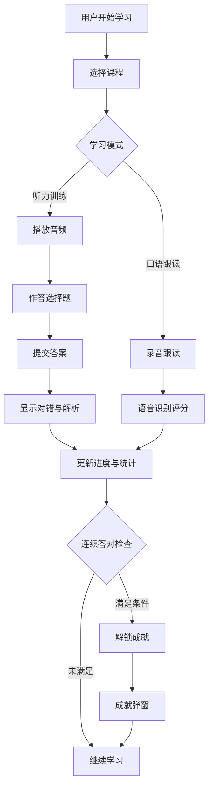

# 英语听力学习平台 PRD

## 1. 产品概述

一款面向高中英语学习者的离线网页端听力学习平台，以高考真题为核心素材，提供分级课程、互动训练、进度追踪与成就激励一体化体验，打造沉浸式语言学习环境。

- **目标用户**：备战高考的高中生、英语听力自学者
- **核心价值**：离线可用、真题驱动、进度可视化、成就激励持续学习
- **设计参考**：每日英语听力 App 的模块化学习体验

## 2. 核心功能

### 2.1 用户角色

| 角色 | 注册方式 | 核心权限 |
|------|---------|---------|
| 学习者 | 免登录（本地用户） | 浏览课程、学习训练、查看进度与成就 |
| 管理者（录入者） | 本地权限切换 | 录入高考听力真题、管理课程内容 |

### 2.2 功能模块

1. **首页（学习中心）**：今日学习概览、继续学习入口、学习连续打卡、推荐课程、最近成就
2. **课程库**：按难度（简单/中等/困难）筛选、分类浏览、课程卡片预览
3. **课程学习页**：听力训练（音频播放+选择题）、口语跟读（语音识别评分）、原文展示、答题反馈
4. **真题录入页**：录入高考听力选择题（题干、选项、正确答案、音频、解析）、难度标记
5. **成就中心**：成就墙、解锁进度、连续答对统计
6. **学习统计**：学习时长趋势、答题正确率、连续打卡日历、薄弱环节分析

### 2.3 页面详情

| 页面名称 | 模块名称 | 功能描述 |
|---------|---------|---------|
| 首页 | 今日概览卡片 | 显示今日学习时长、连续打卡天数、本周正确率 |
| 首页 | 继续学习 | 上次未完成课程的快速入口，显示进度条 |
| 首页 | 推荐课程 | 根据难度和进度推荐 3-4 门课程 |
| 首页 | 最近成就 | 展示最近解锁的 3 个成就 |
| 课程库 | 难度筛选器 | 三段式标签切换（简单/中等/困难） |
| 课程库 | 课程网格 | 卡片展示课程封面、难度色标、课时数、完成度 |
| 课程学习页 | 音频播放器 | 播放/暂停、倍速、进度条、A-B 复读 |
| 课程学习页 | 听力选择题 | 题干+四选项，提交后显示对错与解析 |
| 课程学习页 | 口语跟读 | 原文显示、录音、语音识别比对、发音评分 |
| 课程学习页 | 原文脚本 | 可隐藏/显示的听力原文，支持点击单词查询 |
| 真题录入页 | 题目表单 | 年份、难度、题干、四选项、正确答案、音频上传、解析 |
| 真题录入页 | 题目列表 | 已录入题目管理、编辑、删除 |
| 成就中心 | 成就墙 | 网格展示所有成就，已解锁高亮，未解锁灰色 |
| 成就中心 | 连续答对统计 | 当前连续答对数、历史最高记录 |
| 学习统计 | 学习时长趋势 | 折线图展示近 7/30 天学习时长 |
| 学习统计 | 打卡日历 | 日历视图标记学习日期 |
| 学习统计 | 正确率分析 | 按难度统计正确率，识别薄弱环节 |

## 3. 核心流程

### 3.1 听力训练流程

用户进入课程 → 播放音频 → 听题作答 → 提交答案 → 查看对错与解析 → 系统记录答题结果 → 更新连续答对计数 → 检查成就解锁 → 更新学习进度

### 3.2 口语跟读流程

用户选择跟读模式 → 显示原文 → 点击录音 → 朗读句子 → 停止录音 → 语音识别转文字 → 与原文比对计算相似度 → 给出评分与反馈 → 记录练习次数

### 3.3 成就解锁流程

用户答题 → 答对 → 连续答对计数 +1 → 触发成就检查 → 满足条件则解锁 → 弹窗展示成就 → 写入数据库 → 更新成就墙

## 4. 用户界面设计

### 4.1 设计风格

- **整体风格**：现代编辑风（Editorial）+ 温暖学术感，参考精品语言学习杂志的排版美学
- **主色调**：深墨蓝 `#1A2B4A`（主色）+ 暖米白 `#FAF6EE`（背景）+ 琥珀金 `#D4A24C`（成就/强调）
- **难度色系**：简单 `#6B9E78`（青草绿）、中等 `#D4A24C`（琥珀金）、困难 `#C8553D`（赤陶红）
- **按钮风格**：圆角矩形（8px），主按钮深色填充，次按钮描边
- **字体方案**：
  - 中文标题：`Noto Serif SC`（思源宋体）— 学术质感
  - 中文正文：`Noto Sans SC`（思源黑体）— 清晰易读
  - 英文展示：`Fraunces`（衬线展示字体）— 优雅有性格
  - 英文正文：`Plus Jakarta Sans` — 现代简洁
- **布局风格**：左侧固定导航栏 + 右侧内容区，卡片式内容组织
- **图标风格**：线性图标（Lucide），细线条 1.5px，与学术风匹配

### 4.2 页面设计概览

| 页面名称 | 模块名称 | UI 元素 |
|---------|---------|---------|
| 首页 | 顶部欢迎区 | 大字号问候语、日期、今日学习目标进度环 |
| 首页 | 数据卡片 | 三栏卡片：今日时长、连续打卡、本周正确率，带微动画 |
| 首页 | 继续学习卡 | 大尺寸卡片，左侧封面图，右侧进度条与继续按钮 |
| 首页 | 推荐课程 | 横向滚动卡片，难度色标徽章 |
| 课程库 | 筛选栏 | 三段式标签切换器，带滑动指示器动画 |
| 课程库 | 课程网格 | 3 列卡片，hover 上浮效果，难度色带 |
| 课程学习页 | 音频播放器 | 底部固定栏，圆形播放按钮，波形进度条 |
| 课程学习页 | 题目区 | 卡片式题目，选项 hover 高亮，提交后对错色变 |
| 课程学习页 | 跟读区 | 麦克风按钮（录音中脉冲动画），评分环形进度 |
| 真题录入页 | 表单区 | 分步骤表单，字段分组清晰 |
| 成就中心 | 成就墙 | 蜂窝式网格布局，已解锁徽章发光效果 |
| 学习统计 | 图表区 | 折线图+日历热力图，柔和配色 |

### 4.3 响应式设计

- **桌面优先**：设计以 1280px+ 桌面端为主，左侧导航 240px + 右侧内容区
- **平板适配**：768-1280px，导航栏可折叠为图标条
- **移动端**：<768px，底部 Tab 导航，单列卡片布局
- **触摸优化**：按钮最小 44px 触摸区域，音频播放器支持手势滑动

## 5. 技术约束

- **离线优先**：所有功能在无网络环境下可用，数据库存储于浏览器本地
- **数据持久化**：SQLite 数据库通过 IndexedDB 持久化，刷新不丢失
- **音频处理**：支持音频上传与播放，倍速控制（0.75x/1x/1.25x/1.5x）
- **语音能力**：使用 Web Speech API（SpeechSynthesis 朗读 + SpeechRecognition 识别）
- **无后端依赖**：纯前端应用，可静态部署
