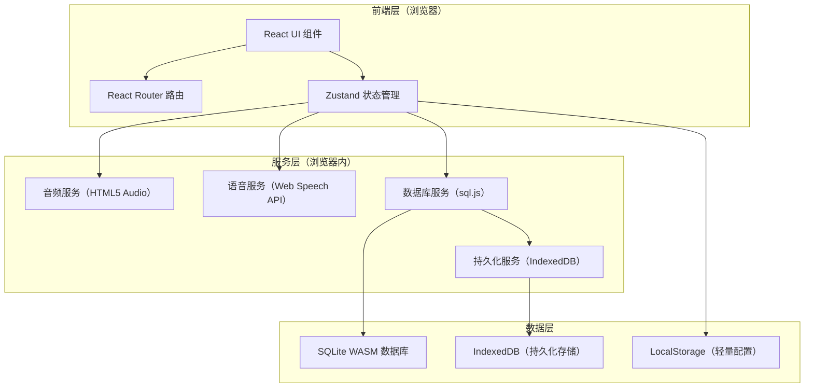
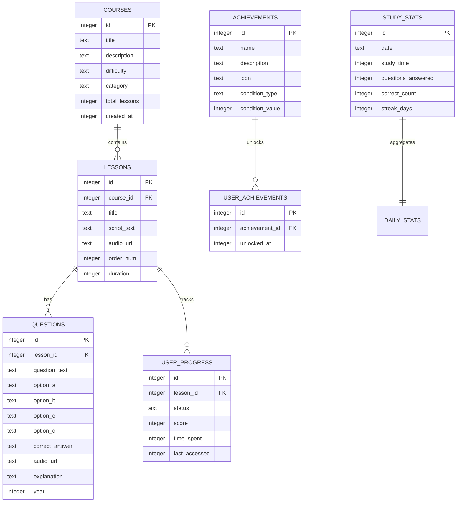

# 英语听力学习平台 - 技术架构文档

## 1. 架构设计



## 2. 技术栈说明

- **前端框架**：React 18 + TypeScript
- **构建工具**：Vite 5
- **样式方案**：TailwindCSS 3
- **路由**：React Router 6
- **状态管理**：Zustand（轻量、无 boilerplate）
- **数据库**：sql.js（SQLite 编译为 WebAssembly，纯前端运行）
- **持久化**：IndexedDB（存储 SQLite 数据库文件二进制）
- **音频处理**：HTML5 Audio API
- **语音能力**：Web Speech API（SpeechSynthesis + SpeechRecognition）
- **图表**：Recharts（学习统计可视化）
- **图标**：Lucide React
- **字体**：Google Fonts（Noto Serif SC、Noto Sans SC、Fraunces、Plus Jakarta Sans）

## 3. 路由定义

| 路由 | 页面 | 功能 |
|------|------|------|
| `/` | 首页（学习中心） | 今日概览、继续学习、推荐课程、最近成就 |
| `/library` | 课程库 | 按难度筛选课程、分类浏览 |
| `/learn/:courseId` | 课程学习页 | 听力训练、口语跟读、原文查看 |
| `/admin` | 真题录入 | 录入/管理高考听力真题 |
| `/achievements` | 成就中心 | 成就墙、连续答对统计 |
| `/stats` | 学习统计 | 学习时长、正确率、打卡日历 |

## 4. 数据模型

### 4.1 ER 图



### 4.2 数据定义语言（DDL）

```sql
-- 课程表
CREATE TABLE IF NOT EXISTS courses (
    id INTEGER PRIMARY KEY AUTOINCREMENT,
    title TEXT NOT NULL,
    description TEXT,
    difficulty TEXT NOT NULL CHECK(difficulty IN ('simple', 'medium', 'hard')),
    category TEXT,
    total_lessons INTEGER DEFAULT 0,
    created_at INTEGER NOT NULL
);

-- 课时表
CREATE TABLE IF NOT EXISTS lessons (
    id INTEGER PRIMARY KEY AUTOINCREMENT,
    course_id INTEGER NOT NULL,
    title TEXT NOT NULL,
    script_text TEXT,
    audio_url TEXT,
    order_num INTEGER DEFAULT 0,
    duration INTEGER DEFAULT 0,
    FOREIGN KEY (course_id) REFERENCES courses(id) ON DELETE CASCADE
);

-- 题目表（高考听力选择题）
CREATE TABLE IF NOT EXISTS questions (
    id INTEGER PRIMARY KEY AUTOINCREMENT,
    lesson_id INTEGER NOT NULL,
    question_text TEXT NOT NULL,
    option_a TEXT,
    option_b TEXT,
    option_c TEXT,
    option_d TEXT,
    correct_answer TEXT NOT NULL,
    audio_url TEXT,
    explanation TEXT,
    year INTEGER,
    FOREIGN KEY (lesson_id) REFERENCES lessons(id) ON DELETE CASCADE
);

-- 用户学习进度
CREATE TABLE IF NOT EXISTS user_progress (
    id INTEGER PRIMARY KEY AUTOINCREMENT,
    lesson_id INTEGER NOT NULL UNIQUE,
    status TEXT DEFAULT 'not_started' CHECK(status IN ('not_started', 'in_progress', 'completed')),
    score INTEGER DEFAULT 0,
    time_spent INTEGER DEFAULT 0,
    last_accessed INTEGER,
    FOREIGN KEY (lesson_id) REFERENCES lessons(id) ON DELETE CASCADE
);

-- 成就定义表
CREATE TABLE IF NOT EXISTS achievements (
    id INTEGER PRIMARY KEY AUTOINCREMENT,
    name TEXT NOT NULL,
    description TEXT NOT NULL,
    icon TEXT NOT NULL,
    condition_type TEXT NOT NULL,
    condition_value INTEGER NOT NULL
);

-- 用户已解锁成就
CREATE TABLE IF NOT EXISTS user_achievements (
    id INTEGER PRIMARY KEY AUTOINCREMENT,
    achievement_id INTEGER NOT NULL UNIQUE,
    unlocked_at INTEGER NOT NULL,
    FOREIGN KEY (achievement_id) REFERENCES achievements(id) ON DELETE CASCADE
);

-- 每日学习统计
CREATE TABLE IF NOT EXISTS study_stats (
    id INTEGER PRIMARY KEY AUTOINCREMENT,
    date TEXT NOT NULL UNIQUE,
    study_time INTEGER DEFAULT 0,
    questions_answered INTEGER DEFAULT 0,
    correct_count INTEGER DEFAULT 0,
    streak_days INTEGER DEFAULT 0
);

-- 连续答对记录
CREATE TABLE IF NOT EXISTS streak_records (
    id INTEGER PRIMARY KEY AUTOINCREMENT,
    current_streak INTEGER DEFAULT 0,
    max_streak INTEGER DEFAULT 0,
    updated_at INTEGER NOT NULL
);

-- 初始化成就数据
INSERT OR IGNORE INTO achievements (name, description, icon, condition_type, condition_value) VALUES
    ('初出茅庐', '连续答对 3 题', 'sparkles', 'consecutive_correct', 3),
    ('渐入佳境', '连续答对 5 题', 'flame', 'consecutive_correct', 5),
    ('听力达人', '连续答对 10 题', 'headphones', 'consecutive_correct', 10),
    ('满分王', '连续答对 20 题', 'crown', 'consecutive_correct', 20),
    ('坚持不懈', '连续学习 3 天', 'calendar-check', 'study_days', 3),
    ('学习先锋', '连续学习 7 天', 'medal', 'study_days', 7),
    ('月度冠军', '连续学习 30 天', 'trophy', 'study_days', 30),
    ('完成首课', '完成第一个课时', 'book-open', 'lessons_completed', 1),
    ('学有所成', '完成 10 个课时', 'graduation-cap', 'lessons_completed', 10),
    ('真题大师', '完成 50 道题目', 'award', 'questions_answered', 50);

-- 初始化连续答对记录
INSERT OR IGNORE INTO streak_records (id, current_streak, max_streak, updated_at) VALUES
    (1, 0, 0, 0);
```

## 5. 核心服务设计

### 5.1 数据库服务（DBService）

- 基于 sql.js 加载 SQLite WASM
- 启动时从 IndexedDB 读取数据库二进制，初始化 sql.js
- 每次写操作后自动持久化到 IndexedDB
- 提供统一的查询接口（query / execute）

### 5.2 音频服务（AudioService）

- 封装 HTML5 Audio 对象
- 支持播放/暂停、进度跳转、倍速控制
- 支持 A-B 复读循环
- 支持音频文件上传并转为 Blob URL 存储

### 5.3 语音服务（SpeechService）

- **朗读（TTS）**：使用 SpeechSynthesis API，支持英式/美式发音、语速调节
- **识别（STT）**：使用 SpeechRecognition API，识别用户跟读内容
- **评分算法**：基于编辑距离（Levenshtein Distance）计算原文与识别文本的相似度

### 5.4 成就检查服务（AchievementService）

- 监听答题事件，更新连续答对计数
- 比对成就条件，触发解锁
- 通过 Zustand store 通知 UI 层展示成就弹窗

## 6. 项目目录结构

```
DailyCheckinEN/
├── public/
│   └── sql-wasm.wasm              # SQLite WASM 文件
├── src/
│   ├── components/                # 通用组件
│   │   ├── Layout/                # 布局组件（导航、侧边栏）
│   │   ├── AudioPlayer/           # 音频播放器
│   │   ├── QuestionCard/          # 题目卡片
│   │   ├── AchievementBadge/      # 成就徽章
│   │   └── ui/                    # 基础 UI 组件
│   ├── pages/                     # 页面组件
│   │   ├── Home.tsx               # 首页
│   │   ├── Library.tsx            # 课程库
│   │   ├── Learn.tsx              # 学习页
│   │   ├── Admin.tsx              # 真题录入
│   │   ├── Achievements.tsx       # 成就中心
│   │   └── Stats.tsx              # 学习统计
│   ├── services/                  # 服务层
│   │   ├── db.ts                  # 数据库服务
│   │   ├── audio.ts               # 音频服务
│   │   ├── speech.ts              # 语音服务
│   │   └── achievement.ts         # 成就服务
│   ├── store/                     # Zustand 状态
│   │   ├── useAppStore.ts         # 全局状态
│   │   └── useLearnStore.ts       # 学习状态
│   ├── types/                     # TypeScript 类型
│   ├── utils/                     # 工具函数
│   ├── App.tsx
│   ├── main.tsx
│   └── index.css
├── index.html
├── package.json
├── tailwind.config.js
├── tsconfig.json
└── vite.config.ts
```

## 7. 关键技术决策

| 决策点 | 方案 | 理由 |
|--------|------|------|
| 数据库 | sql.js (SQLite WASM) | 满足"本地数据库 SQLite"要求，纯前端运行，离线可用 |
| 持久化 | IndexedDB | 可存储大二进制数据（SQLite 文件），容量大，异步 API |
| 状态管理 | Zustand | 轻量无 boilerplate，适合中型应用 |
| 语音识别 | Web Speech API | 浏览器原生支持，无需第三方服务，离线可用（部分浏览器） |
| 音频存储 | Blob URL + IndexedDB | 上传的音频文件转为 Blob 存储于 IndexedDB |
| 构建 | Vite | 快速 HMR，原生 ES Module，开箱即用 |
